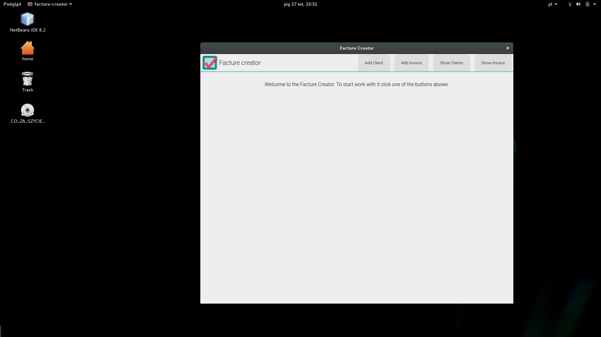

# facture-creator


Simple facture creator with local database of customers and transactions. 

## Technical documentation
Facture-creator is an [Electron](https://github.com/electron/electron) app, so it is written in JavaScript/NodeJS. To store data it use [PouchDB](https://github.com/pouchdb/pouchdb), which is the browser implementation of [Apache CouchDb](https://github.com/apache/couchdb)

### Database schema
An application has simple database schema. There is the only one type of document, which generate one instance for every client. All model is created by JavaScript objectsas you can se on the below diagram.


### Technologies:
Here are technologies used in this project. 
* NodeJS / JavaScript - implementation language
* Electron - Technology to build desktop application
* PouchDB / CouchDB - Database technology
* All production and develop dependencies are listed in [package.json](package.json) file.

### Development 

If you want to develop this program by yourself or contributing this project - feel free but first look at [Contributing.md](CONTRIBUTING.md) where are the rules. 
If you want to develop your own app based on it, clone this repository and just do it. To stasrt you need NodeJS and npm and write to console these commands.
```npm
npm install
npm build &&npm start
```
Facture creator use electron-packager for creating releases on every OS you want. If you want to use it write this spell:
```npm
electron-packager ./builds --all
```
For more information visit [electron-packager page](https://github.com/electron-userland/electron-packager)

## User guide
If you want to use this app just download one of releases. If there isn't package for your OS or architecture visit [electron-packager page](https://github.com/electron-userland/electron-packager) to see if it's possible to build app for it. 
Then you have to build this program by yourself.
### Installation 
You don't need install it, just build and start work. 
### Using app

This is the main screen of the app. Now it's very easy and comfortable. You have 4 menu tabs on the top. Then it is able to add new clients to database, and show theirs data and invoices. 


