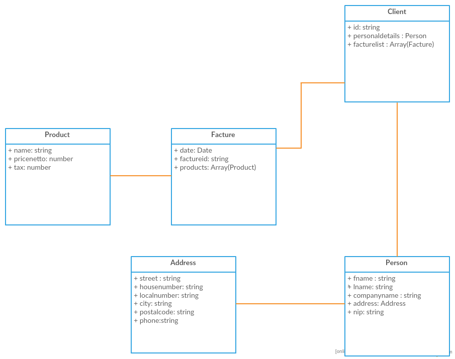

# facture-creator

Simple facture creator with local database of customers and transactions. 

##Technical documentation
Facture-creator is an [Electron](https://github.com/electron/electron) app, so it is written in JavaScript/NodeJS. To store data it use [PouchDB](https://github.com/pouchdb/pouchdb), which is the browser implementation of [Apache CouchDb](https://github.com/apache/couchdb)

###Database schema
An application has simple database schema. There is the only one type of document, which generate one instance for every client. All model is created by JavaScript objectsas you can se on the below diagram.

